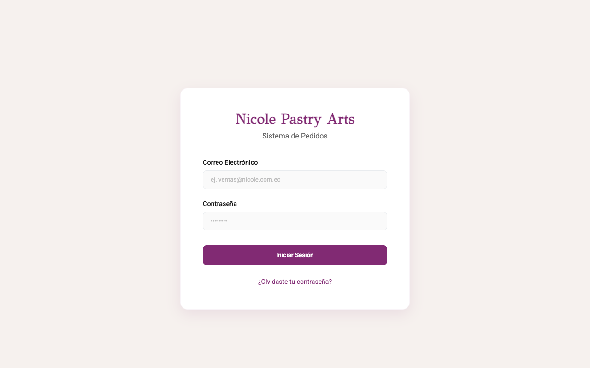
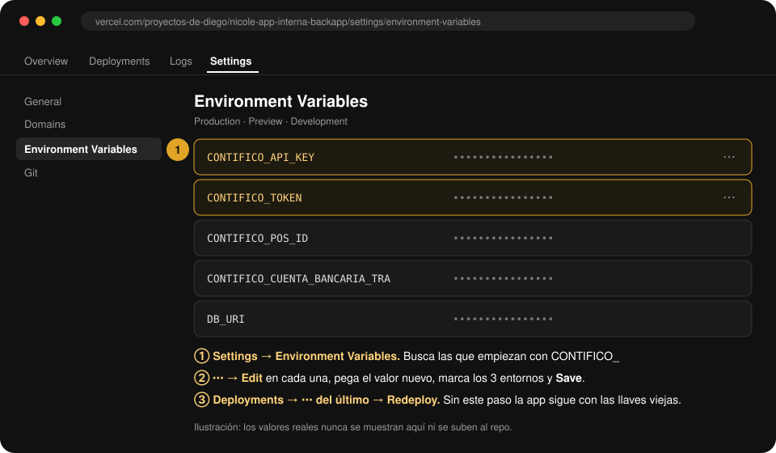

<div align="center">

# 🧁 App interna · Nicole Pastry Arts — **Backapp**

**API de pedidos, facturación electrónica con Contífico, producción y bodega.**

[](https://app.nicole.com.ec)
[](https://nicole-order-backapp.vercel.app)
[](https://github.com/yeyodev1/nicole-app-interna-frontapp)

</div>

---

## 🔗 Todo en un solo lugar

| | Backapp (este repo) | Frontapp |
|---|---|---|
| **GitHub** | [yeyodev1/nicole-app-interna-backapp](https://github.com/yeyodev1/nicole-app-interna-backapp) | [yeyodev1/nicole-app-interna-frontapp](https://github.com/yeyodev1/nicole-app-interna-frontapp) |
| **Vercel** | [nicole-app-interna-backapp](https://vercel.com/proyectos-de-diego/nicole-app-interna-backapp) | [nicole-app-interna-frontapp](https://vercel.com/proyectos-de-diego/nicole-app-interna-frontapp) |
| **URL producción** | https://nicole-order-backapp.vercel.app | **https://app.nicole.com.ec** |
| **Variables de entorno** | [Abrir en Vercel ↗](https://vercel.com/proyectos-de-diego/nicole-app-interna-backapp/settings/environment-variables) | [Abrir en Vercel ↗](https://vercel.com/proyectos-de-diego/nicole-app-interna-frontapp/settings/environment-variables) |

> [!NOTE]
> La URL de la API sigue siendo `nicole-order-backapp.vercel.app` (el nombre anterior del proyecto) porque el frontapp apunta ahí. También responde en `nicole-app-interna-backapp.vercel.app`.

<p align="center">
  
</p>

<p align="center">
  
  <br><sub>Así se ve la app en <a href="https://app.nicole.com.ec">app.nicole.com.ec</a></sub>
</p>

---

## 🔑 Conectar otra cuenta de Contífico (en 3 pasos)

Todo lo de Contífico vive en **variables de entorno del backapp**. No hay que tocar código ni el frontapp.

<p align="center">
  
</p>

### Paso 1 · Saca las llaves en Contífico

En el panel de Contífico de la empresa, en la sección de **API / integraciones**, copia:

- **API Key**
- **Token** (el token de la API, no la contraseña de usuario)

> Si no aparece esa sección, se le pide a soporte de Contífico que habilite el acceso por API para la empresa.

### Paso 2 · Pégalas en Vercel

Abre 👉 **[Environment Variables del backapp](https://vercel.com/proyectos-de-diego/nicole-app-interna-backapp/settings/environment-variables)** y edita (⋯ → **Edit**) estas dos:

| Variable | Qué poner | Obligatoria |
|---|---|:---:|
| `CONTIFICO_API_KEY` | La API Key de Contífico | ✅ |
| `CONTIFICO_TOKEN` | El Token de la API de Contífico | ✅ |

Marca **Production, Preview y Development** y dale **Save**.

### Paso 3 · Redeploy

Ve a **[Deployments](https://vercel.com/proyectos-de-diego/nicole-app-interna-backapp/deployments)** → ⋯ del deploy más reciente de producción → **Redeploy**.
En ~30 s la app ya factura con la cuenta nueva.

> [!IMPORTANT]
> Vercel **no** aplica variables nuevas a lo que ya está desplegado. Si te saltas el Redeploy, la app sigue usando las llaves viejas.

### ¿Funcionó?

Entra a [app.nicole.com.ec](https://app.nicole.com.ec), abre **Nuevo Pedido** y busca un producto: si ves el catálogo de la cuenta nueva, quedó conectado. ✅

---

## ⚙️ Ajustes opcionales de Contífico

Sólo si la cuenta nueva es **otra empresa** (otro RUC, otros bancos, otra caja). Si no los pones, se usan los valores de Nicole.

| Variable | Para qué sirve | Por defecto |
|---|---|---|
| `CONTIFICO_POS_ID` | Caja (punto de venta) de Contífico que emite las facturas. Vacía → se detecta sola desde `/caja/`. | Caja de Nicole |
| `CONTIFICO_ESTABLECIMIENTO` | Primer bloque de la serie de la factura (`001`-001-000000123) | `001` |
| `CONTIFICO_PUNTO_EMISION` | Segundo bloque de la serie (001-`001`-000000123) | `001` |
| `CONTIFICO_CUENTA_BANCARIA_TRA` | ID de la cuenta bancaria donde se registran las transferencias | Banco Guayaquil de Nicole |
| `CONTIFICO_PRECIO_FINAL_IDS` | IDs de productos cuyo precio ya incluye IVA, separados por coma | Delivery |
| `CONTIFICO_SECUENCIAL_MINIMO` | Piso del número de factura (el contador nunca baja de aquí) | `0` |
| `CONTIFICO_SECUENCIALES_EXCLUIDOS` | Rango de números que se salta, ej. `1000001-1000010` | `1000001-1000010` |

**Segunda cuenta (Sucree).** La app maneja una segunda empresa en paralelo con sus propias variables: `CONTIFICO_SUCREE_API_KEY`, `CONTIFICO_SUCREE_TOKEN` y `CONTIFICO_SUCREE_POS_ID`.

> [!WARNING]
> **Numeración de facturas.** Si cambias a una empresa con otra serie, corre una vez `pnpm seed:invoice-sequence -- --desde DD/MM/AAAA` para que el contador arranque desde la última factura real de esa serie. Detalles en `src/config/contifico-emision.config.ts`.

---

## 🧩 Resto de variables del backapp

| Variable | Para qué sirve | Obligatoria |
|---|---|:---:|
| `DB_URI` | Conexión a MongoDB | ✅ |
| `JWT_SECRET` | Firma de las sesiones de usuario. Si falta, usa un valor por defecto: conviene ponerla | ⚠️ |
| `RESEND_API_KEY` / `EMAIL_FROM` | Envío de correos (recuperar contraseña, avisos) | — |
| `FRONTEND_URL` | Links dentro de los correos | — |
| `CRON_SECRET` | Protege los endpoints que llama el cron de GitHub Actions | — |
| `METRICS_API_URL` / `METRICS_API_TOKEN` | Métricas de Meta Ads en analytics | — |

---

## 🚀 Cómo se despliega

```
develop  ──push──►  Preview en Vercel
   │
   └── PR a main ──merge──►  Producción (automático, ~20 s)
```

1. Trabaja en `develop` y haz push.
2. `gh pr create --base main` y merge.
3. Vercel despliega `main` solo. No hay que hacer nada más.

## 💻 Correr en local

```sh
pnpm install
vercel env pull .env   # baja las variables del proyecto (necesita acceso al equipo en Vercel)
pnpm dev               # http://localhost:8100/api
```

| Comando | Qué hace |
|---|---|
| `pnpm dev` | Servidor con recarga automática |
| `pnpm build` | Compila a `dist/` |
| `pnpm seed:users` | Crea los usuarios por defecto |
| `pnpm seed:sellers -- --source <nicole\|sucree>` | Trae los vendedores desde Contífico |
| `pnpm seed:invoice-sequence -- --desde DD/MM/AAAA` | Alinea el contador de facturas con Contífico |

## 🗂️ Estructura

```
src/
├── routes/        endpoints (/api/orders, /api/products, /api/pos, …)
├── controllers/   req/res
├── services/      lógica + contifico.service.ts
├── models/        esquemas de Mongoose
└── config/        serie de facturas, banco, precios con IVA
```

Más detalle técnico en [`CLAUDE.md`](CLAUDE.md).

---

<div align="center"><sub>Hecho por <a href="https://bakano.ec">Bakano</a> para Nicole Pastry Arts 🧁</sub></div>
